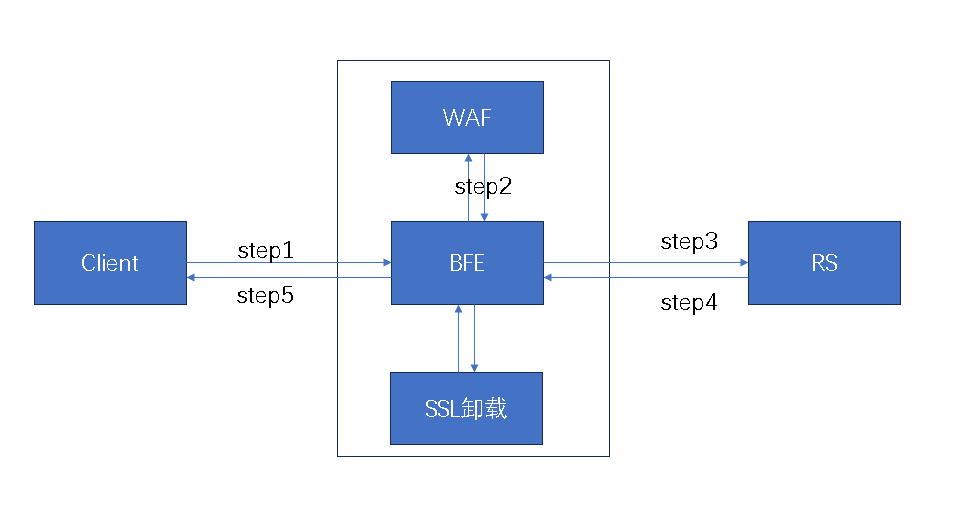

# BFE WAF Interface介绍

## 目的
引入BWI(BFE WAF Interface)的目的是为提升BFE接入WAF服务的效率，给用户一致的体验。

## BFE WAF访问模型



说明
- step1：BFE接收客户端的请求，进行各类处理
- step2：BFE根据业务策略与WAF负载均衡算法调用某一个WAF实例的检测能力，如果WAF检测存在攻击，则执行对应的动作，否则跳到step3
- step3：BFE访问后端RS
- step4：BFE获得后端RS的返回
- step5：BFE把响应返回客户端

注意：
- 在BFE中，BFE管理WAF的单位是单个WAF实例，有独立的IP， Port

# BFE WAF Interface 定义

## WAF检测结果
```
const (
    WAF_RESULT_PASS  = 0
    WAF_RESULT_BLOCK = 1
)
type WafResult interface {
    //get result flag (WAF_RESULT_PASS or WAF_RESULT_BLOCK)
    GetResultFlag() int

    //get attack event id
    GetEventId()string;	
}
```

WafResult表示Waf检测的结果，下面是具体成员说明。
### GetResultFlag
- 功能：返回检测结果标识
- 原型：func GetResultFlag() int
- 参数：无
- 返回值：int，通过或者拒绝
- 使用场景：BFE依赖这个函数的返回确定如何处理

### GetEventId
- 功能：返回具体的检测事件标识
- 原型：func GetEventId() string
- 参数：无
- 返回值：string，本次检测的eventid
- 使用场景：在一些业务场景中，当WAF服务返回拒绝时，BFE客户端可以根据这个eventid，在WAF系统中找到攻击的详细信息


## WAF检测服务
```
//WAF server agent in client side
type WafServer interface {
    func DetectRequest(req *http.Request, logId string) (WafResult, error);
    func UpdateSockFactory(socketFactory func() (net.Conn, error));
    func Close();
}
```

WafServer表示WAF检测服务实例，下面是具体成员说明。

### DetectRequest
- 功能：检测http 请求
- 原型：func DetectRequest(req *http.Request, logId string) (WafResult, error);
- 参数：  
    - req *http.Request：http 请求
    - logId string: 表示当前请求的logId
- 返回值：
    - WafResult: 检测结果，具体参考上文
    - error：调用失败时的错误信息
- 使用场景：WAF http 请求检测
- 注意：
    - logId表示当前请求的id，通过这个字段可以在多个系统中标识出同一个请求
    - 当一个http 请求多次进行WAF检测重试时，会携带同一个logId
    - 建议WAF系统中记录这个字段，方便排查问题与数据追溯

### UpdateSockFactory
- 功能：更新socketFactory函数
- 原型：func UpdateSockFactory(socketFactory func() (net.Conn, error))
- 参数：  
    - socketFactory func() (net.Conn, error)：socketFactory函数，具体说明参考下文
- 返回值：无
- 使用场景：使用者会修改建立连接的参数，需要更新socketFactory

### Close
- 功能：关闭当前的服务实例
- 原型：func Close()
- 参数：无 
- 返回值：无
- 使用场景：关闭当前的服务实例，逻辑上调用这个函数后，后续的DetectRequest，UpdateSockFactory调用都应该返回err。

### socketFactory说明
- 功能：创建与WAF实例的新连接
- 原型： func() (net.Conn, error)
- 参数：无 
- 返回值：如果创建成功，则返回net.Conn, nil; 否则返回nil, error
    - net.Conn: 与WAF实例的新连接
    - error：创建失败时的错误信息
- 使用场景：创建与WAF实例的新连接，或者现有连接错误后，重新创建


## 包级别函数
```
    func NewWafServerWithPoolSize(socketFactory func() (net.Conn, error), poolSize int) (WafServer, error);
    func HealthCheck(conn net.Conn) error;
```

### NewWafServerWithPoolSize
- 功能：创建WafServer实例
- 原型：func NewWafServerWithPoolSize(socketFactory func() (net.Conn, error), poolSize int) (WafServer, error)
- 参数：  
    - socketFactory func() (net.Conn, error)：socketFactory初始值
    - poolSize int：连接池大小
- 返回值：
    - WafServer：WafServer实例
    - error : 创建失败，返回error
- 使用场景：创建WafServer实例
- 注意：
    - poolSize时指连接池最大值，活跃连接数不能超过这个值
    - WafServer的实现方应该实现连接的健康检测，如果有连接不可用，可以重新建立新连接
    - 此函数调用时，不用立即创建与WAF服务实例的连接，采用使用时（即调用DetectRequest时）再创建的方式

### HealthCheck
- 功能：Waf实例健康检测函数
- 原型：func HealthCheck(conn net.Conn) error
- 参数：  
    - conn net.Conn：与WAF实例的连接
- 返回值：error
- 使用场景：BFE会使用函数维护WAF实例的健康状态

# 使用端例子

下面是使用端的伪代码摘要，是为了接口实现者更好地理解上述的接口。
值得注意的是：
- 上述的接口、函数会在多个go routine中同时调用，实现者要兼顾高并发调用下的安全与性能


## WAF Server管理：初始化
```
type BfeWafServer {
    server WafServer
    ....
}

var wafServers []BfeWafServer

...
for wafInstanceAddr, _ := range(wafInstanceAddrList) {
    server, err := NewWafServerWithPoolSize(
        func() (net.Conn, error) {
            conn, err := net.DialTimeout("tcp", wafInstanceAddr, newtimeout)
            if (err != nil) {
                monitor.state.Inc(bfe_basic.NET_ERR, 1)
            }
            return conn, err
        }, poolSize)
    if (err == nil) {
        tmp := NewBfeWafServer(server, ....)
        wafServers = appends(wafServers, tmp)
    }
    ...
}
...


```

## WAF Server管理：更新WAF 实例池
```
//使用场景：客户调整WAF 实例时，存在如下三类情况
//WAF实例删除
//WAF实例新增
//WAF实例维持不变

var newWafServers []BfeWafServer
...
//计算WAF实例池差集，交集
...

//对于维持不变的WAF实例
for wafInstanceAddr, _ := range(keepWafInstanceAddrList) {
    //根据wafInstanceAddr找到对应的wafServer
    newWafServers = append(newWafServers, wafServer)
}
...
//对于新增的WAF实例
for wafInstanceAddr, _ := range(addedWafInstanceAddrList) {
    ...
    server, err := NewWafServerWithPoolSize(
        func() (net.Conn, error) {
            conn, err := net.DialTimeout("tcp", wafInstanceAddr, newtimeout)
            if (err != nil) {
                monitor.state.Inc(bfe_basic.NET_ERR, 1)
            }
            return conn, err
        }, poolSize)
    ...
    if (err == nil) {
        tmp := NewBfeWafServer(server, ....)
        newWafServers = appends(newWafServers, tmp)
    }
    ...
}
...
//对于删除的WAF实例
for wafInstanceAddr, _ := range(deletedWafInstanceAddrList) {
    //根据wafInstanceAddr找到对应的wafServer
    wafServer.server.Close()
    ....
}
...
wafServers = newWafServers
...

```

## WAF Server管理：关闭
```
...
...
for wafServer, _ := range(wafServers) {
    wafServer.server.Close()
}
...

```


## 检测go routine：对请求进行检测
```
//会有多个检测 go routine
...
//通过WAF负载均衡算法取出一个WAF Server
wafServer, err := smoothWrr(wafServers) 
//构造请求，访问WAF
...
var http_req1 http.Request 
...initialize http_req1 and logid1....
.......
res, err := wafServer.server.DetectRequest(http_req1, logid1)
...check err....
if (res.GetResultFlag() == WafResultBlock) {
    //in some scenario, need to return event id
	eid := res.GetEventId()
	...set eid to http response and return ...
}
....
```

## 更新socketFactory的go routine
```
//更新WAF Server实例的sockFactory
...
wafServer.server.UpdateSockFactory(
	func() (net.Conn, error) {
		conn, err := net.DialTimeout("tcp", wafserverAddress, newtimeout2)
		if (err != nil) {
			monitor.state.Inc(bfe_basic.NET_ERR, 1)
		}
		return conn, err
	}
)
...
```

## WAF Server实例健康检查go routine
```
//每一个WAF Server实例都有自己的健康检查go routine
....
for {
    每隔一段时间调用一次doCheck
    更新WAF实例健康状态
    ...
}

func doCheck(wafInstanceAddr string) bool {
    ...
    conn, err := net.DialTimeout("tcp", wafInstanceAddr, healthCheckConnTimeout * time.Second)
    ...
    err := HealthCheck(conn);
    if err != nil {
        ...waf instance may not be available...
    } else {
        ...
    }
    err = conn.Close()
    ....
}

```


# 附录


